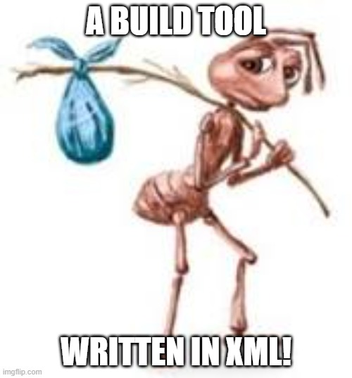
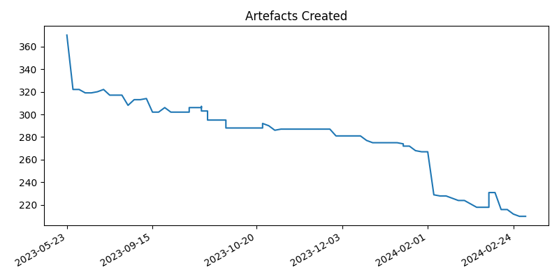
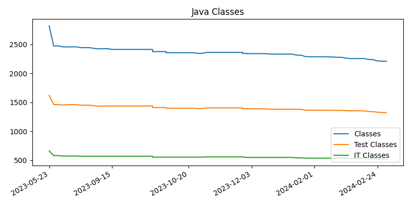
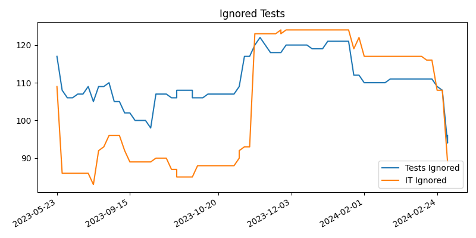
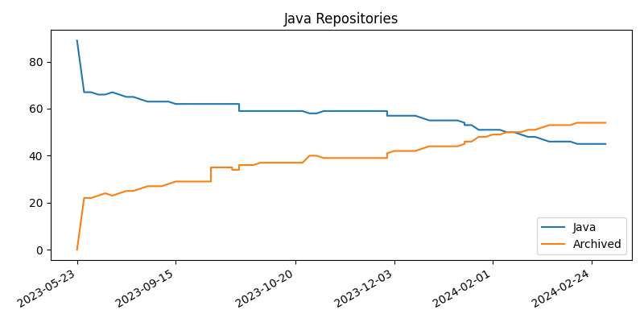
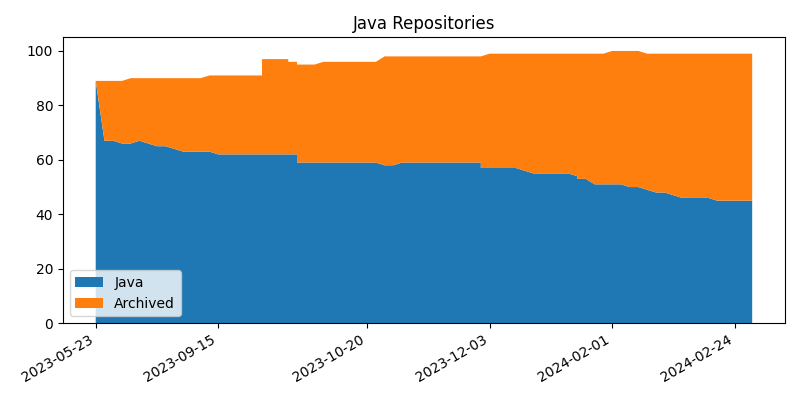
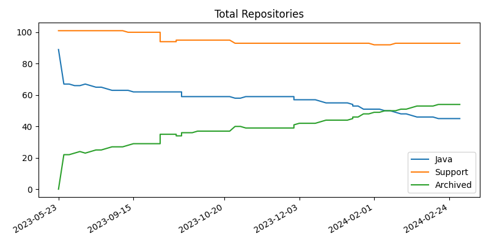
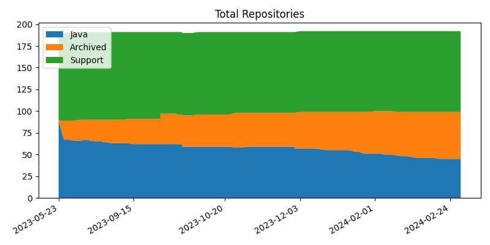
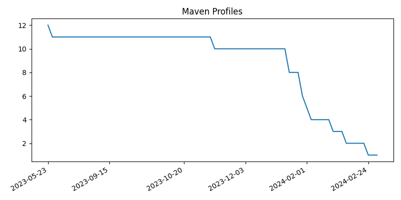

# Long Lived  Maven Projects

.footer: [default theme](LLMP_default.html) | [abyss theme](LLMP_abyss.html) | [void theme](LLMP_void.html) | [white theme](LLMP_white.html) |[slides](https://pizeyt.github.io/LLMP/LLMP_default.html) |[github](https://github.com/pizeyt/pizeyt.github.io/tree/master/LLMP)

# Tim . Pizey . UK

----
# Keep polishing

----
# Talk Structure
## The Road to Maven
## Long Lived Projects
## Current Project
## Take Aways

----
## The Road to Maven

## bash
## make
## ant
## maven 
## maven2
## maven3
## gradle 

----

# Bash 
    !bash
    hereRaw=    `dirname $0`
    if [ "$hereRaw" = . ] ; then
    here=
    else
    here="$hereRaw/"
    fi

    echo -e "Compiling using $JAVAC\n"

    ldb="$here"org.melati.LogicalDatabase.properties
    ldbe="$ldb.example"

    if [ ! -e "$ldb" ] && [ -e "$ldbe" ] ; then
    echo >&2 -e "*** warning: $ldb not found, \nso creating new $ldb from" \
    "$ldbe\n\n"
    cp $ldbe $ldb
    fi
----
    !bash
    [ -e "$ldb" ] &&
    wronglines=`grep -v '^[[:space:]]*[#!]' "$ldb" | fgrep -n jdbc1` &&
    echo -e >&2 "*** warning: your $ldb mentions jdbc1 rather than jdbc2" \
    "in the following lines:\n\n$wronglines\n\n" \
    "You must use JDK1.2 with Melati now, so you should change them to jdbc2."
----
# The Good Bit
    !bash
    find "$hereRaw" \( -path "$hereRaw/playing" -o \
       -path "$hereRaw/doc/example" -o \
       -path "$hereRaw/test" -o \
       -path "$hereRaw/template" \) \
       -prune -o \
       -name '*.java' -print0 | xargs -0 $JAVAC

----
# Make
    !bash

    .PHONY: all

    all:
    @echo "Warning: at present this (FIXME) doesn't rescan Poem.dsd"
    @echo "(which doesn't matter for most users)"
    @echo
    ./compile.sh

----
# ant

https://ant.apache.org/

----
## ant
    !xml
    <!--
    In order to compile WebMacro, you may need to set these environment variables
        JAVACC_HOME: your JavaCC installation home
     -->
    <!--
    Note, you will need ANT 1.5.x, available from:
          http://jakarta.apache.org/ant
    -->
    <project name="WebMacro" default="usage" basedir=".">

    <target name="usage">
        <echo><![CDATA[
    Usage:
    ant TARGET [-Dproperty1=value -DpropertyN=value]
----
    !xml
    <target name="compile" depends="prepare, precompile">
        <filter token="VERSION" value="${version}" />
        <filter token="BUILD_DATE" value="${TODAY}" />
        <copy todir="${tmpdir}" filtering="true">
            <fileset dir="src" />
        </copy>
        <javac srcdir="${tmpdir}"
            fork="yes"
            destdir="${classes}"
            debug="on" optimize="off" deprecation="off">
          <classpath refid="class.path" />
        </javac>
        <copy todir="${classes}">
            <fileset dir="${tmpdir}" includes="**/*.properties" />
        </copy>
        <copy file="WebMacro.defaults.${wm-style}" tofile="${classes}/WebMacro.defaults"/>
        <touch file="${classes}/WM-VERSION-${version}" />
    </target>

---- 
# Maven

----
# Maven - the name 

"Someone who is dazzlingly skilled in any field.

synonyms: ace, adept, champion, genius, hotshot, sensation, star, superhero, superstar, virtuoso, whiz, whizz, wiz, wizard."

(not known outside of US) 

----
# Maven History

----
## Maven (1)
It's all about the POM

and the docs
[https://maven.apache.org/](https://maven.apache.org/)

----
# &nbsp;
## Maven2
    !bash
    .m2/repository
Yay!

## Maven3
Err

## Gradle
Whatever

----
# Long Lived Maven Projects
## Chat GPT 
## Blogging
## Slogans
## Press Release Driven Development

----
# GhatGPT
### What happens when you use Maven for a long time?
Using Maven for a long time can lead to various outcomes, both positive and negative, depending on how it's utilized and the context of its usage. Here are some potential scenarios:

----
#### Increased Project Stability:
Over time, as you become more familiar with Maven, your project setups become more standardized and stable. Maven's dependency management ensures that your project remains consistent and avoids dependency conflicts, leading to fewer build errors and smoother development processes.

----
#### Efficient Build Management:
With experience, you become more proficient in configuring Maven builds efficiently. You might create custom plugins or optimize configurations to streamline the build process, leading to faster builds and improved productivity.

----
#### Dependency Management Challenges:
As projects grow larger and dependencies proliferate, managing them can become increasingly complex. Dependency conflicts, version mismatches, and transitive dependencies can lead to headaches and require careful management to avoid runtime issues.

----
#### Build Tool Fatigue:
While Maven is powerful, it's not the only build tool available. After using it for a long time, some developers might start feeling its limitations or desire to explore alternative build tools like Gradle or Bazel for specific projects or scenarios.

----
#### Maintenance Overhead:
As projects evolve, maintaining Maven configurations can become time-consuming, especially if the project structure or dependencies need frequent updates. Keeping up with new releases, security patches, and best practices can also require ongoing effort.

----
#### Community Support and Resources:
Long-term use of Maven often means tapping into a vast community of users and resources, including documentation, forums, and plugins. This ecosystem can provide valuable insights, solutions to common problems, and opportunities for collaboration.

----
#### Dependency Ecosystem Changes:
Over time, the libraries and frameworks your project depends on might evolve or even become deprecated. Staying abreast of these changes and updating dependencies accordingly is essential to ensure the long-term viability and security of your project.

----
In summary, using Maven over the long term can lead to greater stability, efficiency, and community support for your projects. However, it also comes with challenges such as dependency management complexity and ongoing maintenance overhead. Adaptability and staying informed about best practices and ecosystem changes are key to maximizing the benefits of long-term Maven usage.

---- 
# ChatGPT

- `Tim:` Keep answers short and to the point
- `CGPT:` With prolonged use of Maven, you may encounter dependency conflicts, build errors, and potentially slower build times due to the accumulation of dependencies and configurations. It's important to regularly update dependencies and plugins to mitigate these issues.

----
# Blogger

- <a href="https://tim-pizey.blogspot.com/2009/01/first-post.html" target=_>
First Post - January 2009
</a>
- <a href="https://tim-pizey.blogspot.com/2023/07/press-release-driven-development.html" target=_> 
  Press Release Driven Development</a>
- <a href="https://tim-pizey.blogspot.com/2023/08/variety-build-up-in-long-lived-project.html" target=_> 
  Variety Build Up in a Long Lived Project</a>
- <a href="https://tim-pizey.blogspot.com/2023/09/making-maven-dependency-tree-readable.html" target=_>
  Making the Maven Dependency Tree Readable</a>
- <a href="https://tim-pizey.blogspot.com/2023/11/unique-versions-as-pitons-out-of-maven.html" target=_> 
  Unique version</a>
- <a href="https://tim-pizey.blogspot.com/2024/01/maven-version-schema-change.html" target=_>
  germ of an idea</a>
- <a href="https://tim-pizey.blogspot.com/2024/01/maven-version-versions-and-regex-block.html" target=_>
  Best laid plans</a>
- <a href="https://tim-pizey.blogspot.com/2024/01/five-element-maven-version-numbering.html" target=_>
  N5 Versioning</a>
- <a href="https://tim-pizey.blogspot.com/2024/02/remembrancemd-tombstones-for-git.html" target=_>
  Tombstones</a>

# Presenter Notes

I am a blogger
Blogs are good.  

----
# Slogans
## DRY
### Do NOT Repeat Yourself

## Mono-Repo
### #monolithsGood
### MicroServicesBad

## For all ∀ 

----
# PR Driven Development 
###Internal Press Release: $name Upgrade Completed
###Anticipated release date see Epic Ticket

## Today we can announce the upgrade of $name

In the process we have achieved the following:

- Extended and upgraded our ability to act upon and monitor all repositories
- Archived XX repositories
- Reduced the number of ignored tests from XX to XX
- Removed all Sonar Bugs and Vulnerabilities
- Updated all libraries
- Installed Dependabot to ensure we do not fall behind again

### This enables us to take on the strategic work of ....

---- 
# Git Tombstones

- Nothing is lost in git, delete with confidence
- Out of sight out of mind

---- 
# rememberance.md

| File                |    Date    | Reason                                   |
|---------------------|:----------:|:-----------------------------------------|
| maven-tomcat-plugin | 2013-11-11 | Who knows, the team just walked away     |
| tpp-module          | 2024-02-22 | Finished polishing, flushing now         |
| my-perl-script.pl   | 2019-03-23 | Moving on up                             |

----
# Current Project

---- 
# Pom Lines

    find * -name pom.xml |xargs wc -l

    Was : 40675
    Is:   23525 

----
# Automated Progress Reporting 

----
# Artefacts

----

# Classes

----

# Ignored Tests

----

# Java Repositories

----

# Java Repositories Stacked

----

# Total Repositories

----
# Total Repositories Stacked

----
# Profiles

----
    !XML

    <properties>
        <git.repo.name>module23</git.repo.name>
    </properties>

    <scm>
        <connection>scm|git|ssh://git@github.com/timp/${git.repo.name}</connection>
        <developerConnection>scm|git|ssh://git@github.com/timp/${git.repo.name}</developerConnection>
        <url>scm|git|ssh://git@github.com/timp/${git.repo.name}</url>
        <tag>HEAD</tag>
    </scm>

----
# Work around Maven 'inheritance'
    !XML
	<scm 
            child.scm.connection.inherit.append.path="false" 
            child.scm.developerConnection.inherit.append.path="false" 
            child.scm.url.inherit.append.path="false">
		<connection>scm|git|ssh://git@github.com/timp/${git.repo.name}</connection>
		<developerConnection>scm|git|ssh://git@github.com/timp/${git.repo.name}</developerConnection>
		<url>scm|git|ssh://git@github.com/timp/${git.repo.name}</url>
		<tag>HEAD</tag>
        </scm>

---
    !XML

    <properties>
        <git.repo.name>module23</git.repo.name>
    </properties>

----
# Archiving

- Merge all branches
- Close all pull request
- If not passing tests document in README
- Put reason for archiving in README
- Mark as archived in github

## Archiving is scary so should be done by a Team Lead

----
# Versioning
Date.Build ?

     !XML 
     <dependency>
       <groupId>commons-io</groupId>
       <artifactId>commons-io</artifactId>
       <version>20030203.000550</version>
       <scope>test</scope>
     </dependency>

For those without Groups:

     !XML 
     <dependency>
       <groupId>hsqldb</groupId>
       <artifactId>hsqldb</artifactId>
       <version>1.8.0.1</version>
       <scope>compile</scope>
     </dependency>

      <dependency>
        <groupId>com.elsevier.smd</groupId>
        <artifactId>smd-local-dynamodb-support</artifactId>
        <version>2017-03-01</version>
      </dependency>

      <dependency>
        <groupId>org.eclipse.jetty</groupId>
        <artifactId>jetty-security</artifactId>
        <version>8.1.7.v20120910</version>
        <scope>test</scope>
      </dependency>

----
# Do not use properties for versions
## Naming is hard
## Do not introduce a new, private, unvalidated property naming system

     !XML 
     <properties>
       <aws.sdk.version>1.12.287</aws.sdk.version>
     </properties>
	<dependency>
		<groupId>com.amazonaws</groupId>
		<artifactId>aws-java-sdk-dynamodb</artifactId>
		<version>${aws.sdk.version}</version>
	</dependency>
	<dependency>
		<groupId>com.amazonaws</groupId>
		<artifactId>aws-java-sdk-sqs</artifactId>
		<version>${aws.sdk.version}</version>
	</dependency>
	<dependency>
		<groupId>com.amazonaws</groupId>
		<artifactId>aws-java-sdk-core</artifactId>
		<version>${aws.sdk.version}</version>
	</dependency>
	<dependency>
		<groupId>com.amazonaws</groupId>
		<artifactId>aws-java-sdk-sns</artifactId>
		<version>${aws.sdk.version}</version>
	</dependency>

----
# Take Aways

-----
# Take Aways

- Module sequential artifact id needs to be project scoped
- Open Source library maintainers are not responsible for updating their clients, Enterprise Developers are
- Don't use properties for versions
- Archiving is a Team Lead responsibility

-----
# Questions ?

---- 
# More thoughts

*Tip*: Keep a Darkslide slide deck open!

----
# Slides

.qr: https://pizeyt.github.io/LLMP/LLMP_default.html

https://pizeyt.github.io/LLMP/LLMP_default.html

----
# Colophon

.qr: https://github.com/ionelmc/python-darkslide

https://github.com/ionelmc/python-darkslide

